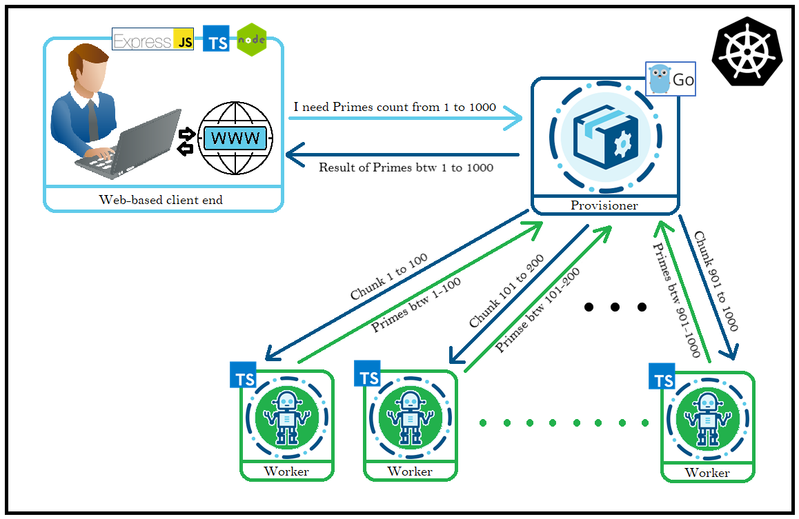

# Distributed/Microservices Prime Numbers Counter
-------------------------------------------------------------------------
This project was developed for explore following areas and technologies:

-   **Technologies**:

    -   [Golang](https://golang.org/)

        -   [Golang channels](https://gobyexample.com/channels)

        -   [Client-go](https://github.com/kubernetes/client-go)

    -   [gRPC](https://grpc.io/)

        -   [Protobuf](https://github.com/protocolbuffers/protobuf)

    -   [Typescript](https://www.typescriptlang.org/)

    -   [Docker](https://www.docker.com/)

    -   [Kubernetes](https://kubernetes.io/)

-   **Areas**

    -   [Distributed
        computing](https://en.wikipedia.org/wiki/Distributed_computing)

    -   [Microservices](https://microservices.io/)

## Prerequisites:

To run this project you will be needing a Kubernetes ready cluster, you
can use
[AKS](https://azure.microsoft.com/en-us/services/kubernetes-service/) or
[GKE](https://cloud.google.com/kubernetes-engine/) also if you want to
test it locally you can run it one
[minikube](https://kubernetes.io/docs/setup/learning-environment/minikube/)
(a local kubernetes cluster for testing purposes). Also you should be familiar with Docker commands and [kubectl](https://kubernetes.io/docs/tasks/tools/install-kubectl/)
Just for a sample, I'm stating two basic commands.

To create Docker image `docker built -t <registry server address>/<image_name>:<version> <directory path to Dockerfile>`

To create a something from a file in kubectl `kubectl create -f <filename>.yaml`

Don't forget to apply the deployments from `preDeployments` folder

## Working:

This repository contains 3 total projects **Client (Typescript)**,
**Provisioner (Golang)** and **Worker (Typescript).** Basic idea of this
project is, Client is a web-based application from where a client send a
request to count prime numbers between a range, the request is sent to
provisioner via gRPC. Provisioner divides the range in chunks if needed
and launches a batch of workers and initiate some channels to listen for
workers of this specific request. Workers calculate primes in their
chunked range and responds back to provisioner. When all the workers for
a specific request has responded, the provisioner sends the total result
to Client.

A diagram shows an overall view of working of this project:

## Details about each service:

-   Each service communicates via gRPC

-   Each service is Dockerized to run as container in Kubernetes

Some technical details are below

1.  **Client**

    -   Written in **TypeScript**

    -   Using **Express Server** and **EJS** Views

    -   Using **gRPC** to communicate with **Provisioner**

    -   **DockerFile** included

2.  **Provisioner**

    -   Written in Golang

    -   Using **gRPC** to communicate with **Client** and **Worker**

    -   Using **Golang** **Channels** to handle the data received from
        workers, totaling and sending the result to client

    -   **DockerFile** included

3.  **Worker**

    -   Written in **TypeScript**

    -   Using **gRPC** to communicate with **Provisioner**

    -   **DockerFile** included

-------------------------------------------------------
**Note**: This project is solemnly for learning purposes that how you
can receive a task from a client and divide that in batch processes and
easily communicate via **gRPC** and also to demonstrate the usage of
**Golang channels** and **gRPC**.
